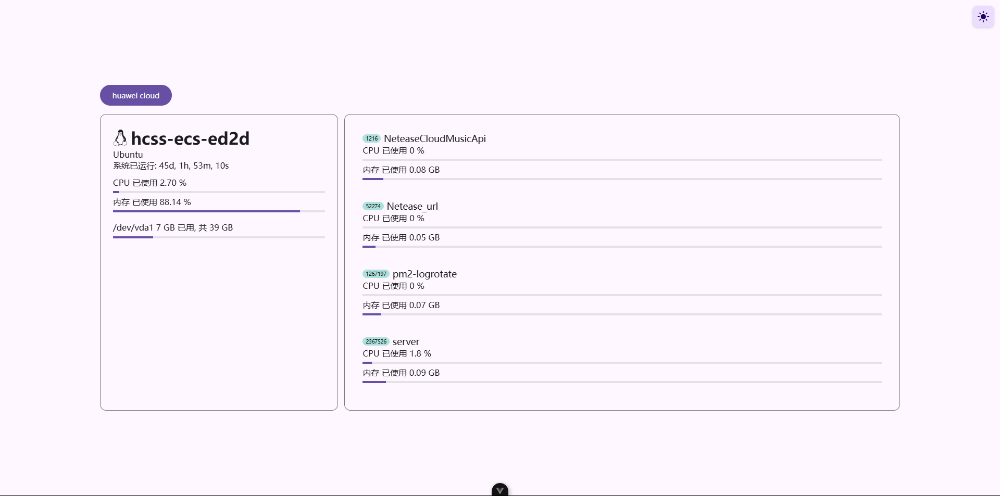

## server_monitoring_page

这是一个服务器性能监测站点, 使用 vue.js 搭建, 通过 socket 和服务器建立实时连接, 实时获取服务器性能数据, 并展示在页面上.

这是前端页面, 你可以把它部署在任何地方, 但需要搭配[后端](https://github.com/sooooooooooooooooootheby/server_monitoring)使用.

## 运行

1. 安装依赖

```bash
pnpm i
```

2. 启动项目

```bash
pnpm run dev
```

3. 打开浏览器, 输入 `http://localhost:5173` 即可访问.

